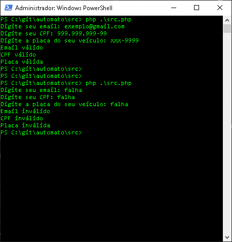

# Autômato
Verificador de Email, CPF e Placa de carro.

Para rodar a aplicação é necessário ter o __PHP__ instalado em sua máquina.

Linux:
```
sudo apt install php
```
Windows:
```
choco install php
```
<br>

>Caso você não tenha o __Chocolatey__ instalado em sua máquina Windows, abra o Poweshell como administrador e rode o comando abaixo.

```
Set-ExecutionPolicy Bypass -Scope Process -Force; [System.Net.ServicePointManager]::SecurityProtocol = [System.Net.ServicePointManager]::SecurityProtocol -bor 3072; iex ((New-Object System.Net.WebClient).DownloadString('https://chocolatey.org/install.ps1'))
```
<br>

Após instalar o __PHP__ reinicie sua máquina. Depois faça o clone do projeto e pelo __Powershell__ vá à pasta `/src` do projeto, execute o comando:

```
php src.php
```
<br>
O resultado será:



